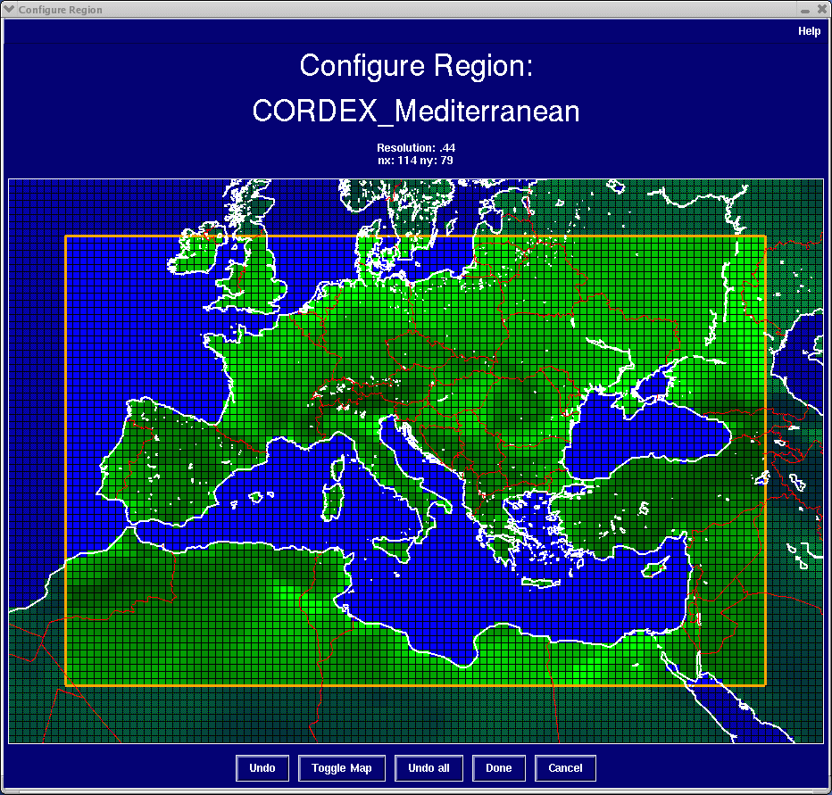
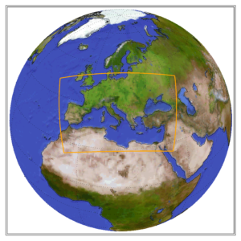

Med-CORDEX is the Mediterranean-focused activity of the international [CORDEX](https://cordex.org/) initiative from the World Climate Research Program (WCRP). It is currently endorsed by the [MedCLIVAR](https://www.medclivar.eu/) and [MedECC](https://www.medecc.org/) international initiatives. It has been supported between 2010 and 2020 by the [HyMeX](https://www.hymex.org/) international project.

# Med-CORDEX Initiative

Med-CORDEX initiative has been proposed in 2009 by the Mediterranean climate research community as a follow-up of previous initiatives such as the European project CIRCE. Med-CORDEX takes advantage of new very high-resolution Regional Climate Models (RCM, up to 10 km) and of new fully coupled Regional Climate System Models (RCSMs), coupling the various components of the regional climate for increasing the reliability of past and future regional climate information and understanding the processes that are responsible for the Mediterranean climate variability and trends. Med-CORDEX defines itself as *an open club of Mediterranean climate model developers and users, science-driven, self-organised and based on voluntary efforts*.

# Med-CORDEX Geographic Areas

The areas surrounding the Mediterranean basin have quite a unique character that results both from their complex morphology and socio-economic conditions.
It is indeed surrounded by various and complex topography channelling regional winds (Mistral, Tramontane, Bora, Etesian, Sirocco) than defined local climates and from which numerous rivers feed the Mediterranean sea.
Many small-size islands limit the low-level air flow and its coastline is particularly complex. Strong land-sea contrast, land-atmosphere feedback, intense air-sea coupling and aerosol-radiation interaction are also among the regional characteristics to take into account when dealing the Mediterranean climate modeling.
In addition, the region features an enclosed sea with a very active regional thermohaline circulation.
It is connected to the Atlantic ocean only by Gibraltar strait and surrounded by very urbanized littorals.

The Mediterranean region is consequently a good case study for climate downscaling tool application and was naturally chosen as one of the inititial CORDEX domain (MED) leading to the Med-CORDEX initiative.
The MED domain is defined in the [CORDEX domain document](https://cordex.org/wp-content/uploads/2012/11/CORDEX-domain-description_231015.pdf)

  

More reference documents and links can be found [here](references.md). 

# Steering Committee

The Med-CORDEX steering committee is managing the day-to-day life of the initiative and in particular the activities related to strategy, internal coordination, external communication and coordination with the CORDEX Science Advisory Team (SAT) and with the other CORDEX activities. All members of the Med-CORDEX steering committee are CORDEX POC (Points of Contact). It is also the main entry point for Med-CORDEX. [You can contact them by email](mailto:medcordex-sc@meteo.fr).

| Institution | Member | Role |
|-------------|--------|------|
| [CNRM](https://cnrm.sedoo.fr/en/homepage/) | [Samuel Somot](mailto:samuel.somot@meteo.fr) | Lead |
| [ICTP](http://www.ictp.it/) | [Erika Coppola](mailto:coppolae@ictp.it) | Member, SAT member |
| [IEO](http://www.ba.ieo.es/) | [Gabriel Jordà](mailto:gabriel.jorda@ieo.csic.es) | Member |
| [ENEA](https://impatti.sostenibilita.enea.it/en/structure/clim) | [Gianmaria Sannino](mailto:gianmaria.sannino@enea.it) | Member |
| [GUF](http://www.iau.uni-frankfurt.de/) | [Bodo Ahrens](mailto:bodo.ahrens@iau.uni-frankfurt.de) | Member |
| [OGS](https://www.ogs.it/) | [Marco Reale](mailto:mreale@ogs.it) | Member |
| [LA](http://www.aero.obs-mip.fr/en) | Fabien Solmon | Former member |
| [ENEA](https://impatti.sostenibilita.enea.it/en/structure/clim) | Paolo Ruti | Former member |

# Coordination and Communication

Med-CORDEX uses various communication tools:
- The [Steering Committee](mailto:medcordex-sc@meteo.fr) and the current  are the main entry gates
- We communicate with the community thanks to a [general emailing list](mailto:medcordex-sc@meteo.fr)
- We chat using a dedicated [Slack](https://medcordex.slack.com)
- We share documents on a dedicated [zenodo community open collection](https://zenodo.org/communities/medcordex/)
- We share information on the [web page](https://med-cordex.github.io/) and on the [github](https://github.com/Med-CORDEX/)

# Modelling Center Contact Points

| Institution | Contact Point |
|-------------|--------------|
| [AWI](https://www.awi.de/en.html) - [GERICS](http://www.climate-service-center.de/index.php.en) | [William Cabos](mailto:william.cabos@uah.es) - [Dmitry Sein](mailto:dmitry.sein@awi.de) |
| [CMCC](http://www.cmcc.it/) | [Silvio Gualdi](mailto:silvio.gualdi@cmcc.it) - [Piero Lionello](mailto:piero.lionello@unisalento.it) |
| [CNRM](https://cnrm.sedoo.fr/en/homepage/) | [Samuel Somot](mailto:samuel.somot@meteo.fr) - [Florence Sevault](mailto:florence.sevault@meteo.fr) |
| [ENEA](http://www.enea.it/) | [Alessandro Anav](mailto:alessandro.anav@enea.it) - [Gianmaria Sannino](mailto:gianmaria.sannino@enea.it) |
| [GUF](http://www.iau.uni-frankfurt.de/) | [Bodo Ahrens](mailto:bodo.ahrens@iau.uni-frankfurt.de) |
| [ICTP](http://www.ictp.it/) | [Erika Coppola](mailto:coppolae@ictp.it) |
| [IMS](http://ims.gov.il/en) | [Pavel Khain](mailto:pavelkh_il@yahoo.com) head of NWP team - [Leenes Uzan](mailto:uzanl@ims.gov.il) - [Elyakom Vadislavsky](mailto:vadislavskye@ims.gov.il) |
| [IPSL](http://www.latmos.ipsl.fr/) | [Jan Polcher](mailto:jan.polcher@lmd.ipsl.fr) - [Romain Pennel](mailto:romain.pennel@lmd.ipsl.fr) |
| [ITU](http://www.itu.edu.tr/) | [Baris Onol](mailto:onolba@itu.edu.tr) |
| [JRC](https://ec.europa.eu/jrc/en) | [Diego Macias-Moy](mailto:Diego.MACIAS-MOY@ec.europa.eu) |
| [LMD](http://www.lmd.jussieu.fr/) | [Laurent Li](mailto:laurent.li@lmd.ipsl.fr) |
| [OGS](http://www.ogs.it/) | [Marco Reale](mailto:mreale@ogs.it) |
| [UCLM](http://www.uclm.es/) | [Miguel Gaertner](mailto:miguel.gaertner@uclm.es) |
| [Univ of Belgrade](http://www.ff.bg.ac.rs/) | [Vladimir Djurdjevic](mailto:vdj@ff.bg.ac.rs) |
