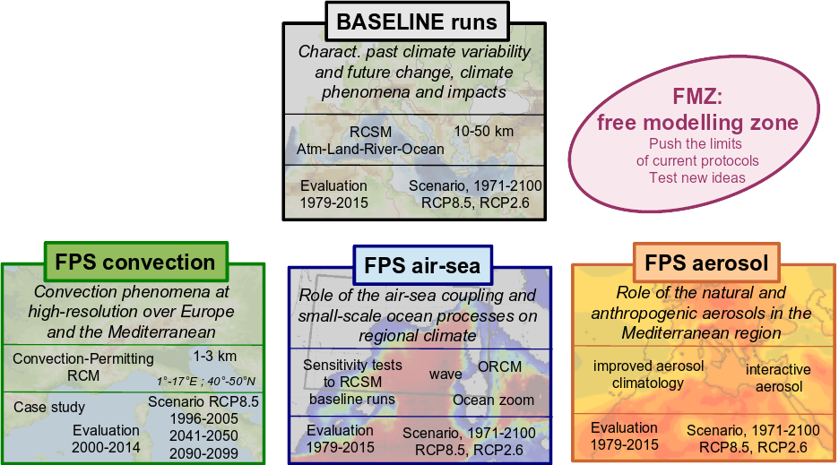



# Phase 1

In its phase 1, Med-CORDEX simulations gather 3 kinds of runs (evaluation, historical, scenario), 4 kinds of regional models (atmosphere, land-surface, ocean, coupled RCSM) and are classified in two categories: CORE simulations and TIER1 simulations.

## CORE simulations

The framework for the Med-CORDEX CORE simulations follows the CORDEX frame over the Mediterranean domain (MED-44):

- Atmosphere-Land only
- 50 km over the MED-44 CORDEX domain
- Evaluation run (ERA-Interim driven runs, 1989-2008 minimum)
- Historical runs (1981-2005 minimum, 1950-2005 advised)
- Scenario runs (RCP8.5, RCP4.5, 2011-2040 or 2041-2070 minimum, 2006-2100 advised)

The simulations are also described on the [HyMeX database web site](https://web.archive.org/web/20240816034834/http://mistrals.sedoo.fr/HyMeX/Plateform-search/?datsType=2). Each form corresponds to one simulation and gives some details about the model, the reference article, the modelling group, etc. It is also possible to access the simulations archived on the MED-CORDEX database from those forms.

## TIER-1 simulations

The TIER1 Med-CORDEX simulations include:

- Extension of the ERA-Interim evaluation CORDEX runs to the longest possible period and in particular to present in order to use the most recent evaluation data available and the HyMeX field campaign results. The period 1979-2013 is advised.
- Production of an ensemble of higher-resolution atmosphere RCM: target resolution is 0.11°, about 12 km (MED-11) but intermediate resolutions are possible.
- Production of an ensemble of simulations with coupled Regional Climate System Models (RCSM), i.e. with fully interactive Atmosphere-Land surface-River-Ocean components, covering the whole Mediterranean basin at high resolution.
- Production of stand-alone simulations for all the components of the RCSM

## Participating teams

Med-CORDEX gathered 22 different modelling groups from 9 different countries in Europe, Middle-East and North-Africa:

| Country   |
|-----------|
|  France |
|  Germany |
|  Greece |
|  Hungary |
|  Italy |
|  Serbia |
|  Spain |
|  Tunisia |
|  Turkey |

The registered modelling groups were:

| Institution | Contact Point |
|-------------|--------------|
|  [AWI](https://web.archive.org/web/20240816034834/https://www.awi.de/en.html) - [GERICS](https://web.archive.org/web/20240816034834/http://www.climate-service-center.de/index.php.en) | [William Cabos](mailto:william.cabos(AT)uah.es), [Dimitry Sein](mailto:dimitry.sein(AT)zmaw.de) |
|  [BSC](https://web.archive.org/web/20240816034834/http://www.bsc.es/) | [Maria Gonçalves Ageitos](mailto:mariag(AT)bsc.es) |
|  [CMCC](https://web.archive.org/web/20240816034834/http://www.cmcc.it/) - [Univ Salento](https://web.archive.org/web/20240816034834/https://www.unisalento.it/) | [Dario Conte](mailto:dario.conte(AT)cmcc.it), [Piero Lionello](mailto:piero.lionello(AT)unisalento.it) |
|  [CNRM](https://web.archive.org/web/20240816034834/http://www.cnrm-game.fr/?lang=en) | [Samuel Somot](mailto:samuel.somot(AT)meteo.fr) |
|  [ENEA](https://web.archive.org/web/20240816034834/http://www.enea.it/) | [Alessandro Anav](mailto:alessandro.anav(AT)enea.it), [Gianmaria Sannino](mailto:gianmaria.sannino(AT)enea.it) |
|  [ENSTA](https://web.archive.org/web/20240816034834/http://www.ensta-paristech.fr/) | [Thomas Arsouze](mailto:thomas.arsouze(AT)ensta-paristech.fr) |
|  [Eotvos Lorand U](https://web.archive.org/web/20240816034834/http://www.elte.hu/) | [Judit Bartholy](mailto:bari(AT)ludens.elte.hu) |
|  [GUF](https://web.archive.org/web/20240816034834/http://www.iau.uni-frankfurt.de/) | [Bodo Ahrens](mailto:bodo.ahrens(AT)iau.uni-frankfurt.de) |
|  [ICTP](https://web.archive.org/web/20240816034834/http://www.ictp.it/) | [Erika Coppola](mailto:coppolae(AT)ictp.it) |
|  [IMS](https://web.archive.org/web/20240816034834/http://ims.gov.il/en) | [Pavel Khain](mailto:pavelkh_il(AT)yahoo.com) |
|  [IPSL](https://web.archive.org/web/20240816034834/http://www.latmos.ipsl.fr/) | [Sophie Bastin](mailto:sophie.bastin(AT)latmos.ipsl.fr) |
|  [ITU](https://web.archive.org/web/20240816034834/http://www.itu.edu.tr/) | [Baris Onol](mailto:onolba(AT)itu.edu.tr) |
|  [JRC](https://web.archive.org/web/20240816034834/https://ec.europa.eu/jrc/en) | [Diego Macias-Moy](mailto:Diego.MACIAS-MOY(AT)ec.europa.eu) |
|  [LMD](https://web.archive.org/web/20240816034834/http://www.lmd.jussieu.fr/) | [Laurent Li](mailto:laurent.li(AT)lmd.jussieu.fr) |
|  [ENSTA](https://web.archive.org/web/20240816034834/http://www.ensta-paristech.fr/) | [Thomas Arsouze](mailto:thomas.arsouze@ensta-paristech.fr) |
|  [Eotvos Lorand U](https://web.archive.org/web/20240816034834/http://www.elte.hu/) | [Judit Bartholy](mailto:bari@ludens.elte.hu) |
|  [GUF](https://web.archive.org/web/20240816034834/http://www.iau.uni-frankfurt.de/) | [Bodo Ahrens](mailto:bodo.ahrens@iau.uni-frankfurt.de) |
|  [ICTP](https://web.archive.org/web/20240816034834/http://www.ictp.it/) | [Erika Coppola](mailto:coppolae@ictp.it) |
|  [IMS](https://web.archive.org/web/20240816034834/http://ims.gov.il/en) | [Pavel Khain](mailto:pavelkh_il@yahoo.com) |
|  [IPSL](https://web.archive.org/web/20240816034834/http://www.latmos.ipsl.fr/) | [Sophie Bastin](mailto:sophie.bastin@latmos.ipsl.fr) |
|  [ITU](https://web.archive.org/web/20240816034834/http://www.itu.edu.tr/) | [Baris Onol](mailto:onolba@itu.edu.tr) |
|  [JRC](https://web.archive.org/web/20240816034834/https://ec.europa.eu/jrc/en) | [Diego Macias-Moy](mailto:Diego.MACIAS-MOY@ec.europa.eu) |
|  [LMD](https://web.archive.org/web/20240816034834/http://www.lmd.jussieu.fr/) | [Laurent Li](mailto:laurent.li@lmd.jussieu.fr) |

## Participating models

- 17 different Atmosphere-RCM (resolution between 10 and 50km)
- 8 different Ocean regional models
- 4 different Land-Surface regional models
- 14 Fully coupled Regional Climate System Models (at least ocean-atmosphere-land)
- 8 GCMs used for the scenario runs

## List of simulations

Note that the following pdf files contain links towards the description of each run (metadata). Clicking such links you access the run information.

- [Atmosphere Regional Climate Models](https://www.medcordex.eu/Tabelle_RUNs/Listofruns_Med-CORDEX_phase1_ARCM.pdf)
- [Land-River Regional Climate Models](https://www.medcordex.eu/Tabelle_RUNs/Listofruns_Med-CORDEX_phase1_LandRiverRCM.pdf)
- [Ocean Regional Climate Models](https://www.medcordex.eu/Tabelle_RUNs/Listofruns_Med-CORDEX_phase1_ORCM.pdf)
- [Fully-coupled Regional Climate System Models](https://www.medcordex.eu/Tabelle_RUNs/Listofruns_Med-CORDEX_phase1_RCSM.pdf)
- [GCM x RCM matrix](https://www.medcordex.eu/Tabelle_RUNs/Listofruns_Med-CORDEX_phase1_GCMRCMmatrix.pdf)

# Phase 2

In its phase 2 (from 2016 onwards), the **overarching goals of the Med-CORDEX initiative** (rephrased from Ruti et al. 2016) are to:

A. Understand the past variability of the Mediterranean regional climate system and characterize its possible future evolution.  
B. Investigate, understand and improve the description of regional climate phenomena with emphasis on phenomena of importance for climatic impacts.  
C. Contribute to improve the characterization of the impacts of the Mediterranean climate variability and climate change.

To full-filled these goals, the phase 2 of Med-CORDEX is based on **five modelling pillars**:

- The [Baseline runs](https://www.medcordex.eu/baseline-runs.php) based on a large ensemble of fully-coupled regional climate system models inherited from Med-CORDEX phase 1.
- The [CORDEX FPS-convection](https://www.hymex.org/cordexfps-convection/wiki/doku.php) based on convection-permitting regional climate models
- The [CORDEX FPS-aerosol](https://www.hymex.org/cordexfps-aerosol/wiki/doku.php) based on an improved representation of aerosols in the regional climate models
- The **CORDEX FPS-airsea** based on an improved representation of small-scale oceanic processes and air-sea coupling in the region climate system models
- The [Free Modelling Zone (FMZ)](https://www.medcordex.eu/list-activities_Med-CORDEX-FMZ.pdf) targeting to study the limitations of the current Med-CORDEX modelling protocols and to test new modelling ideas

*FPS: Flagship Pilot Study, the 3 Med-CORDEX related FPS have been endorsed officially by CORDEX in May 2016*

In its phase 2 as in its phase 2, Med-CORDEX is based on the following **motivations and basic principles**:

- Mediterranean area is considered as a perfect test case for high-resolution and coupled regional climate modelling and a well-identified future climate change hotspot
- Following the end of the CIRCE EU project, Med-CORDEX started in 2009 as the HyMeX regional climate modelling team before becoming an official CORDEX domain
- Med-CORDEX is an open club of Mediterranean climate model developers and users ; self-organised and based on voluntary efforts.
- Med-CORDEX targets to develop reference modelling frameworks for the study the Mediterranean climate and to provide coordinated regional climate simulations for the various components of the Mediterranean climate system
- Med-CORDEX is mainly science-driven
- The major communication tools are the mailing list (medcordex@hymex.org), the web site (www.medcordex.eu) and regular workshops
- Med-CORDEX is leaded by an international steering committee (medcordex-sc@hymex.org): S.Somot (CNRM) ; G.Sannino (ENEA) ; E.Coppola (ICTP) ; G.Jordà (IMEDEA) ; B.Ahrens (GUF) ; F. Solmon (LA)
- Med-CORDEX contributes to the objectives of the following initiatives and projects: CORDEX, MISTRALS (HyMeX, ChArMEx, ImpactCC), Med-CLIVAR, C3S, HORIZON-2020 and MedECC
